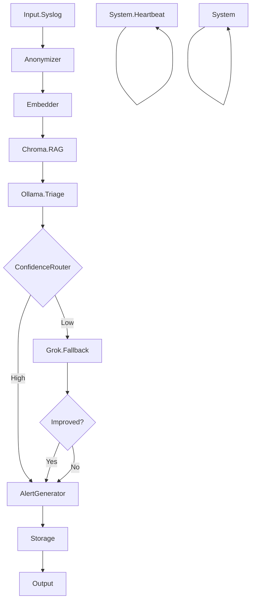

# AitherShield Architecture

## Overview

AitherShield is a privacy-first, hybrid AI-powered Security Information and Event Management (SIEM) system designed to provide intelligent log analysis, alerting, and threat detection while maintaining strong privacy guarantees through data anonymization and local processing.

## System Architecture

### High-Level Components

```
┌─────────────────┐    ┌─────────────────┐    ┌─────────────────┐
│   Client (Tauri │    │   Server (Rust  │    │   External      │
│   + React)      │◄──►│   + Axum)       │◄──►│   Services      │
│                 │    │                 │    │                 │
│ - Dashboard     │    │ - API Endpoints │    │ - Ollama        │
│ - Dataflow Viz  │    │ - WebSocket     │    │ - Elasticsearch │
│ - Alert Monitor │    │ - Pipeline      │    │ - Chroma        │
│ - Settings      │    │ - Analysis      │    │ - Grok API      │
└─────────────────┘    └─────────────────┘    └─────────────────┘
```

### Server Architecture

The server is built with Rust 2024 and Axum 0.7, providing high-performance async processing with Tokio.

#### Core Modules

- **ingestion**: Log parsing, anonymization, and preprocessing
- **storage**: Elasticsearch integration for persistence, Chroma for vector storage
- **alerting**: Alert generation and notification channels
- **lib**: Core SIEM analyzer with LLM backends

#### Pipeline Stages

The analysis pipeline processes logs through the following stages with real-time WebSocket event streaming:



**WebSocket Events**: Each stage emits `PipelineEvent` with status (Started/Completed/Error), latency, confidence, and next stage information.

1. **Input**: Raw log entries received via API or ingestion
2. **Anonymizer**: Removes or masks sensitive information (IP addresses, usernames, etc.)
3. **Embedder**: Generates vector embeddings for semantic search
4. **Ollama Triage**: Initial analysis using local Ollama LLM
5. **Confidence Router**: Evaluates analysis confidence
6. **Grok Fallback**: Re-analysis with Grok API if confidence is low
7. **RAG**: Retrieves relevant context from vector store for enhanced analysis
8. **Alert Generator**: Creates alerts based on severity and configured thresholds

#### LLM Backend Architecture

AitherShield uses a trait-based LLM backend system for flexibility:

```rust
pub trait LlmBackend {
    async fn generate(&self, prompt: &str, model: &str, options: Option<GenerateOptions>) -> Result<String, LlmError>;
    async fn chat(&self, messages: Vec<ChatMessage>, model: &str, options: Option<GenerateOptions>) -> Result<String, LlmError>;
    async fn embed(&self, text: &str, model: &str) -> Result<Vec<f32>, LlmError>;
}
```

- **OllamaBackend**: Local LLM processing via Ollama API
- **GrokApiBackend**: Cloud LLM via xAI Grok API (opt-in for low-confidence cases)

### Client Architecture

The client is built with Tauri v2 + React 19 + TypeScript, providing a native desktop experience.

#### Technology Stack

- **Tauri**: Cross-platform desktop framework
- **React 19**: UI framework with hooks and concurrent features
- **TypeScript**: Type-safe JavaScript
- **Zustand**: State management
- **ReactFlow**: Dataflow visualization (NiFi-style)
- **Tailwind CSS + shadcn/ui**: Styling and UI components

#### Key Features

- **Dashboard**: Real-time metrics and alerts
- **Dataflow Visualization**: NiFi-style interactive pipeline monitoring via WebSocket
- **Alert Management**: Live WebSocket alerts
- **Secure Settings**: Encrypted configuration storage

### Data Flow

1. Logs ingested via API or direct input
2. Anonymization removes sensitive data
3. Embedding generation for semantic context
4. LLM analysis with confidence scoring
5. Optional fallback to Grok for uncertain cases
6. RAG-enhanced analysis using retrieved context
7. Alert generation and notification
8. Persistence to Elasticsearch and Chroma

### Security Considerations

- **Privacy-First**: All processing happens locally by default
- **Anonymization**: Sensitive data masked before analysis
- **Opt-in Cloud**: Grok API only used when confidence is low and explicitly configured
- **Encrypted Storage**: Client settings and sensitive data encrypted
- **Secure Defaults**: Conservative alerting thresholds

### Deployment

- **Docker**: Containerized deployment with docker-compose
- **Local Services**: Ollama, Elasticsearch, Chroma run locally
- **Scalable**: Horizontal scaling support via load balancing

### API Endpoints

- `GET /`: API information
- `GET /status`: System status and metrics
- `GET /alerts`: List recent alerts
- `POST /analyze`: Analyze log entries
- `GET /ws/pipeline-events`: WebSocket for real-time pipeline events (authenticated)
- `POST /pipeline/test`: Trigger full pipeline test flow

### WebSocket Integration

The WebSocket endpoint `/ws/pipeline-events` provides authenticated real-time pipeline event streaming for NiFi-style dataflow visualization:

**Authentication**: API key via `?api_key=xxx` query parameter or `Authorization: Bearer xxx` header.

**Event Structure**:
```json
{
  "event_id": "550e8400-e29b-41d4-a716-446655440000",
  "timestamp": "2026-02-22T12:00:00.123456Z",
  "stage": "Ollama.Triage",
  "status": "completed",
  "log_snippet": "Failed password for invalid user admin from 192.168.1.100",
  "model": "qwen2.5:14b-instruct-q5_K_M",
  "latency_ms": 1250,
  "confidence": 0.85,
  "next_stage": "ConfidenceRouter"
}
```

**Stages**: `Input.Syslog`, `Anonymizer`, `Embedder`, `Chroma.RAG`, `Ollama.Triage`, `ConfidenceRouter`, `Grok.Fallback`, `AlertGenerator`, `Storage`, `System.Heartbeat`, `System`.

**Features**:
- 30-second heartbeat for connection health
- Graceful disconnect handling
- Broadcast channel for multi-client support
- Security: API key validation, no sensitive data logging</content>
</xai:function_call name  
</xai:function_call name="run_in_terminal">
<parameter name="command">cd /home/dgraham/repos/aithershield && cargo check